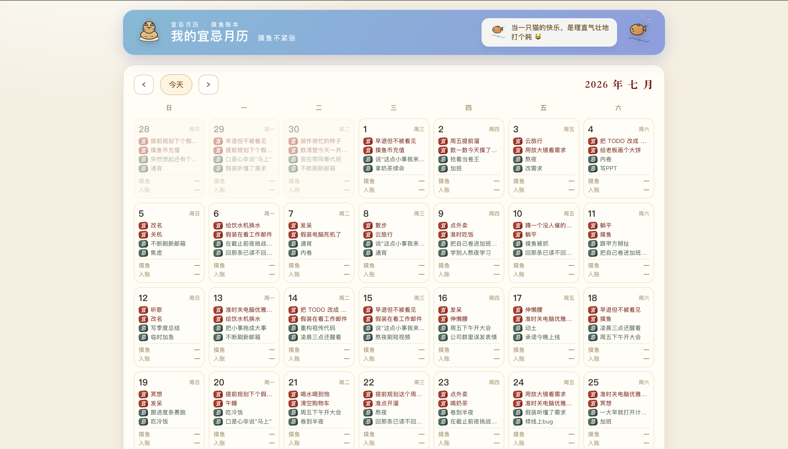
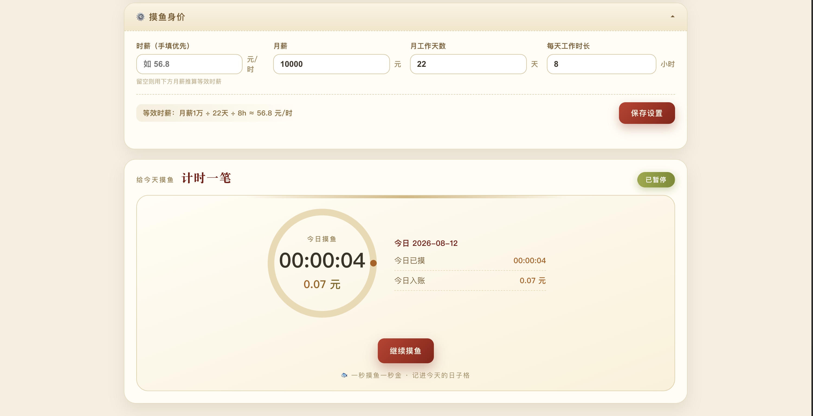
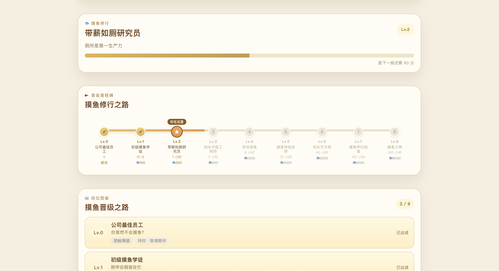
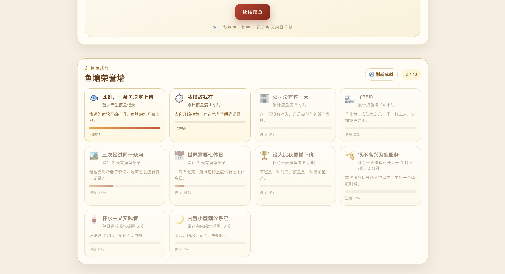
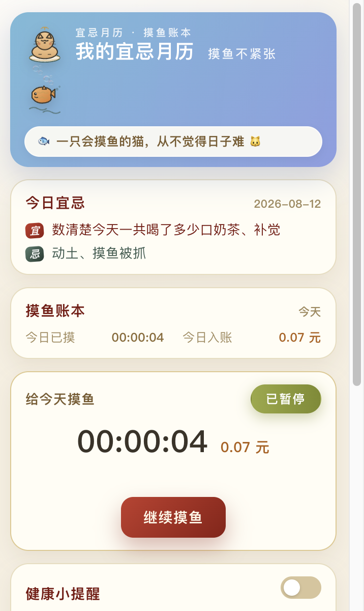
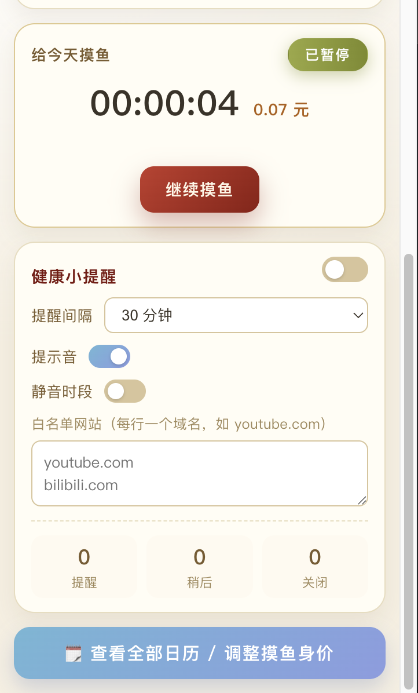

# 宜忌月历 · 摸鱼账本

一个趣味 **Chrome 扩展**（Manifest V3）——每天给你生成专属「宜 / 忌」，记录摸鱼时长并按时薪折算入账，久坐到点还会在当前网页右下角温柔提醒你喝口水、起身活动。摸鱼时长会累积成「摸鱼等级」，还有一只常驻网页的悬浮猫桌宠陪你摸鱼掉币。摸鱼与喝水都能解锁趣味成就，边摸边收集。









## 功能一览

- **宜忌月历**：按月展示每日宜 / 忌，同一天反复打开结果完全一致（日期加盐 PRNG 生成，可复现），跨天自动变化
- **摸鱼账本**：每个日期格子显示当日摸鱼时长与时薪折算金额，小鱼 🐟 标记已有记录
- **摸鱼计时器**：三态状态机（idle → running → paused），基于真实时间戳累计，金额 = 时薪 × 秒数 / 3600；**后台持续计时、关浏览器自动暂停**
- **薪资模型**：支持手填时薪，或按「月薪 ÷ 工作天数 ÷ 日时长」推算等效时薪
- **今日金句**：每天一条猫 / 鱼 / 躺平梗，按日期确定性选取
- **摸鱼等级**：摸鱼累计时长换算成 8 段等级（Lv.0 公司最佳员工 → Lv.8 摸鱼之神），等级只涨不掉；每晋一级发放一次性摸鱼币奖励，小窗与完整页均有「晋级里程碑」修行之路展示
- **悬浮猫桌宠**：一只常驻任意网页右下角的小猫，可拖动、可收起；抚摸有 70% 概率掉 1~3 枚摸鱼币（每日 10 次上限），其余给彩蛋气泡，闲时还会冒出「劝摸」气泡
- **成就系统**：把摸鱼、打开主界面与喝水行为变成可解锁的趣味成就（共 27 个），达标自动解锁并弹出提示
- **喝水提醒**：久坐到点在当前网页右下角弹出轻量浮层，提供「稍后 / 关闭」；支持自定义间隔、静音时段、网站白名单与提示音，全屏看视频 / PPT 或正在输入时自动延后弹出，特殊页面降级为系统通知

## 安装使用

本项目为纯前端 Chrome 扩展，无需构建：

1. Chrome 地址栏打开 `chrome://extensions/`
2. 打开右上角 **开发者模式** 开关
3. 点击 **加载已解压的扩展程序**，选择本仓库的 `extension/` 目录
4. 点击工具栏扩展图标弹出小窗；未显示时点拼图图标把「宜忌月历 · 摸鱼账本」固定到工具栏

扩展提供两种界面，两者共享 `chrome.storage.local`，数据实时一致：

- **简洁小窗**（`popup.html`）— 今日宜忌 + 今日账本 + 紧凑计时器，窄高一眼看全

  

  

- **完整页**（`full.html`，新标签页打开）— 完整月历 + 薪资设置面板 + 计时器

## 项目结构

```
moyu-yiji/
├── extension/               # Chrome 扩展本体（Manifest V3，自包含）
│   ├── manifest.json        # 扩展配置（storage / alarms / notifications / scripting / tabs / offscreen 权限；向所有网页注入 wallet.js + pet-content.js）
│   ├── popup.html           # 简洁小窗：今日宜忌 + 账本 + 紧凑计时器
│   ├── full.html            # 完整月历页（新标签页打开）
│   ├── offscreen.html       # 离屏页（稳定播放喝水提醒提示音）
│   ├── icons/               # 16/32/48/128 PNG 图标
│   ├── assets/              # 猫 / 鱼吉祥物 SVG
│   ├── css/
│   │   ├── style.css        # 月历画风（含小窗紧凑覆盖层）
│   │   └── mascots.css      # 猫 / 鱼吉祥物动画
│   ├── js/
│   │   ├── background.js         # Service Worker：后台持续计时 + 关浏览器自动暂停
│   │   ├── water-reminder.js     # 喝水提醒后台（alarms 调度 + 注入浮层 + 今日统计）
│   │   ├── content-reminder.js   # 注入宿主网页的提醒浮层（防打扰：全屏 / 输入时延后）
│   │   ├── offscreen.js          # 离屏音频脚本（播放提醒提示音）
│   │   ├── mini.js               # 小窗装配 + chrome.storage 适配
│   │   ├── popup.js              # 完整页装配 + chrome.storage 适配
│   │   ├── achievements.js       # 成就定义（清单 + 分类）
│   │   ├── achievement-engine.js # 成就判断引擎（统计快照 / 进度 / 解锁判断）
│   │   ├── calendar-tooltip.js   # 日期悬浮窗
│   │   ├── moyu-timer.js         # 摸鱼计时器状态机（idle / running / paused）
│   │   ├── level.js              # 摸鱼等级系统（引擎 + 结算 + 里程碑渲染 + 自动挂载）
│   │   ├── wallet.js             # 摸鱼币钱包：全系统唯一货币出入口（原子加币）
│   │   ├── pet-content.js        # 悬浮猫桌宠内容脚本（抚摸掉币 + 劝摸气泡，注入任意网页）
│   │   └── yiji-data.js          # 宜忌数据生成（按日期可复现的 PRNG）
│   └── tools/gen_icons.py   # 纯 Python 标准库生成扩展图标
├── assets/                  # 吉祥物素材与预览
│   ├── mascot-cat.svg       # 打盹小猫吉祥物
│   ├── mascot-fish.svg      # 摸鱼小鱼吉祥物
│   ├── mascots.html         # 吉祥物预览页（引用 css/mascots.css）
│   ├── gen_mascots.py       # Python 生成吉祥物脚本
│   └── screenshots/         # README 截图
├── css/mascots.css          # 供 assets/mascots.html 预览页使用
├── docs/                    # 产品与架构文档
│   ├── growth-system-prd.md # 成就 / 成长系统 PRD
│   ├── reminder-prd.md      # 喝水提醒需求文档
│   └── reminder-arch.md     # 喝水提醒架构设计
└── README.md
```

## 技术架构

### 整体结构

```
graph TB
    A[工具栏图标] --> B[popup.html 小窗]
    B --> C[full.html 完整页]
    D[background.js SW] --> E[chrome.storage.local]
    B --> E
    C --> E
    D --> F[water-reminder.js 喝水调度]
    F --> G[content-reminder.js 注入网页浮层]
    F --> H[offscreen.js 提示音]
    I[pet-content.js 桌宠] --> J[wallet.js 摸鱼币钱包]
    J --> E
    B --> K[level.js 摸鱼等级]
    C --> K
    K --> J
```

三方（小窗 / 完整页 / Service Worker）以 `chrome.storage.local` 为唯一数据源，通过 `chrome.storage.onChanged` 实时同步。

### 宜忌生成

[`yiji-data.js`](./extension/js/yiji-data.js) 使用日期加盐的伪随机数生成器（PRNG），保证同一天反复打开结果完全一致，跨天自动变化。

### 摸鱼计时器

[`moyu-timer.js`](./extension/js/moyu-timer.js) 实现三态状态机：

```
idle ──start──▶ running ──pause──▶ paused
 ▲                │                  │
 └────reset───────┴────reset─────────┘
```

- 基于真实时间戳差分累计，不依赖 `setInterval` 精度
- 通过 Service Worker + `chrome.alarms`（1 分钟周期）实现**后台持续计时**：UI 全关时 SW 仍被唤醒补账
- 累计秒数以 `alive`（最近一次确认在计时的打点）为补账基准，写入一律 `max(旧值, acc)` **幂等合并**，多写入者不会重复记账
- **关浏览器自动暂停**：SW 随浏览器终止，`alive` 停更；下次任一 UI 打开时若 `now - alive > 5 分钟`，判定浏览器曾被关闭，自动暂停并只保留已提交秒数

### 喝水提醒

核心依赖 Chrome 扩展 API（`chrome.alarms` / `chrome.scripting` / `chrome.notifications`），流程：

- [`water-reminder.js`](./extension/js/water-reminder.js) 用独立 `chrome.alarms` 周期触发（与摸鱼计时的 alarm 相互独立）
- 到点通过 `chrome.scripting` 向当前网页注入 [`content-reminder.js`](./extension/js/content-reminder.js) 的右下角浮层，提供「稍后（5 分钟）/ 关闭」
- **防打扰**：全屏看视频 / PPT、或正在 input / textarea / contenteditable 输入时自动延后弹出；命中白名单网站或静音时段则暂停
- **兜底**：`chrome://`、PDF 等无法注入 DOM 的特殊页面降级为系统通知
- 提示音由离屏页 [`offscreen.js`](./extension/js/offscreen.js) 稳定播放

### 成就系统

成就分为**定义**与**判断**两层，均与存储 / DOM 解耦：

- [`achievements.js`](./extension/js/achievements.js) — 成就清单（共 27 个），覆盖入口、累计时长、累计天数、连续 / 工作日记录、单日摸鱼与喝水次数
- [`achievement-engine.js`](./extension/js/achievement-engine.js) — 从摸鱼日志、喝水记录与成就辅助统计生成快照，计算进度并判断解锁，不直接读写存储

装配层（`mini.js` / `popup.js`）负责读写解锁状态、渲染卡片与弹出解锁提示。

### 摸鱼等级系统

[`level.js`](./extension/js/level.js) 合并「引擎 + 结算服务 + 展示渲染 + 页面挂载」于一体，导出 `MoyuLevelEngine` / `MoyuLevelService` / `MoyuLevelView` 三个全局对象：

- **等级引擎（纯函数）**：8 段门槛（Lv.0 起、Lv.8 封顶），按累计摸鱼秒数计算当前段位、进度比例与下一级门槛
- **只涨不掉**：等级基于累计时长单调递增，不会因暂停或跨天回落
- **升级发币**：每晋一级发放一次性摸鱼币奖励（Lv.1 起，数值非等差递增），通过 [`wallet.js`](./extension/js/wallet.js) 落账
- **自动挂载**：加载时探测 `#mini-level-chart`（小窗）/ `#full-level-card`（完整页）挂载点，谁在渲染谁；「晋级里程碑」轮播在完整页为三卡弧形、小窗为紧凑单卡

### 悬浮猫桌宠

[`pet-content.js`](./extension/js/pet-content.js) 作为内容脚本注入任意网页右下角，自包含（内嵌 SVG + 样式 + 交互），数据存 `chrome.storage.local`：

- **抚摸掉币**：点按小猫，70% 概率掉 1~3 枚摸鱼币、其余给彩蛋气泡，每日 10 次上限
- **劝摸气泡**：待机时低频冒出「反向监督」气泡，零负担陪伴
- **可拖动 / 可收起**：右上角按钮一键收起为半透明小图标
- **统一钱包**：掉币经 [`wallet.js`](./extension/js/wallet.js) 的 `MoyuWallet.add()` 落账。钱包采用 read-modify-write 原子加币（基于 storage 最新值累加而非缓存覆盖），保证桌宠抚摸与等级升级发币在不同上下文并发时不互相覆盖

### 数据持久化（chrome.storage.local）

| 键 | 内容 |
|----|------|
| `moyu-log:YYYY-MM-DD` | 当日摸鱼累计秒数（单调只增，写入以 `max` 幂等合并） |
| `moyu-settings` | 薪资模型：`{ hourlyRate, monthlySalary, workdays, hoursPerDay }` |
| `moyu-timer-state` | 计时器上下文：`{ status, hourlyRate, accSeconds, startAt, lastLogged, alive }` |
| `moyu-achievements` | 已解锁成就：`{ unlocked: { [id]: { unlockedAt } } }` |
| `pet-coin` | 摸鱼币余额（桌宠抚摸掉币与等级升级奖励共用，钱包原子累加） |
| `pet-pat-day` / `pet-pat-count` | 抚摸掉币次数所属日期与当日已抚摸次数（每日 10 次上限） |
| 喝水提醒相关 | 提醒间隔、开关、提示音、白名单、静音时段与今日提醒 / 稍后 / 关闭统计 |

由于 `chrome.storage` 是异步 API，而渲染以同步读为主，`mini.js` 与 `popup.js` 均采用「初始化时 `await` 恢复全量数据到内存缓存 → 后续读走缓存、写异步落盘」的适配策略，避免闪变。

## 开发

- 扩展为纯静态 HTML / CSS / JS，修改后在 `chrome://extensions/` 点击扩展的刷新按钮即可生效
- 图标与吉祥物可用 [`extension/tools/gen_icons.py`](./extension/tools/gen_icons.py) 和 [`assets/gen_mascots.py`](./assets/gen_mascots.py) 重新生成（纯 Python 标准库）

## License

MIT
