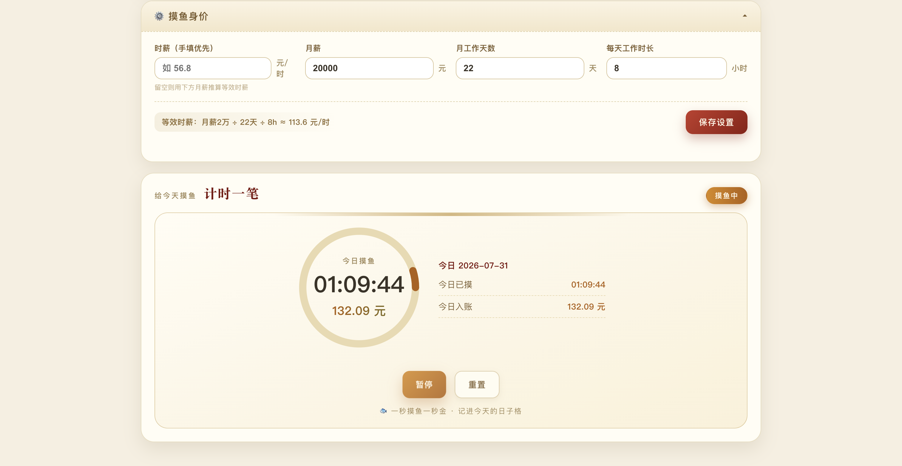
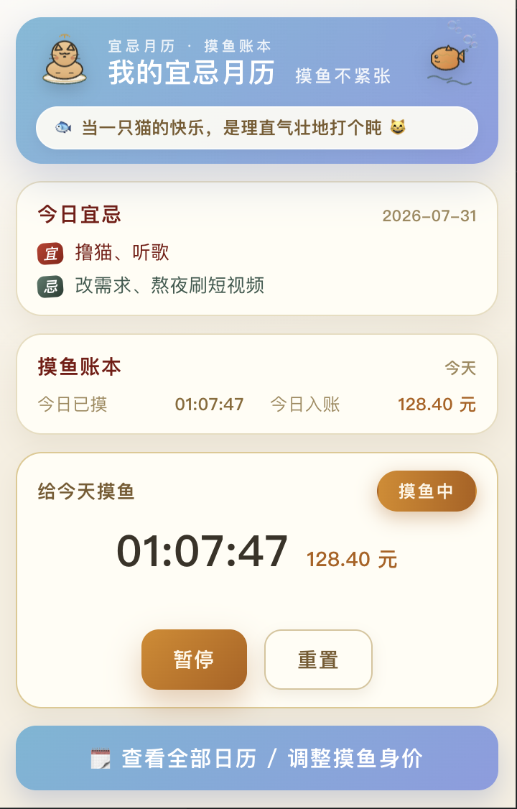

# 宜忌月历 · 摸鱼账本

一个趣味日历应用——每天给你生成专属「宜/忌」，还能记录摸鱼时长、折算成时薪入账；Chrome 扩展版还会在你久坐到点时温柔提醒喝口水、起身活动。支持网页版和 Chrome 扩展两种使用方式。




## 功能一览

- **宜忌月历**：按月展示每日宜/忌，同一天打开结果完全一致（日期加盐 PRNG 生成，可复现）
- **摸鱼账本**：每个日期格子显示当日摸鱼时长与时薪折算金额，小鱼 🐟 标记已有记录
- **摸鱼计时器**：三态状态机（idle → running → paused），基于真实时间戳累计，金额 = 时薪 × 秒数 / 3600
- **薪资模型**：支持手填时薪，或按「月薪 ÷ 工作天数 ÷ 日时长」推算等效时薪
- **今日金句**：每天一条猫/鱼/躺平梗，按日期确定性选取
- **成就系统**：把摸鱼与喝水行为变成可解锁的趣味成就，达标自动解锁并弹出提示；网页版仅启用摸鱼类成就，喝水类成就仅扩展版可见
- **喝水提醒**（仅扩展版）：久坐到点温柔提醒你喝口水、起身活动；支持自定义间隔、静音时段、网站白名单与提示音，全屏看视频/PPT 或正在输入时自动延后弹出

## 项目结构

```
moyu-yiji/
├── index.html              # 网页版入口
├── css/
│   ├── style.css           # 主样式（月历画风）
│   └── mascots.css         # 猫/鱼吉祥物动画
├── js/
│   ├── app.js              # 网页版主逻辑（月历网格 + 摸鱼账本 + 计时器 + 薪资设置 + 成就）
│   ├── achievements.js     # 成就定义（清单 + 分类）
│   ├── achievement-engine.js   # 成就判断引擎（统计快照 / 进度 / 解锁判断）
│   ├── moyu-timer.js       # 摸鱼计时器状态机（idle / running / paused）
│   └── yiji-data.js        # 宜忌数据生成（按日期可复现的 PRNG）
├── assets/
│   ├── mascot-cat.svg      # 打盹小猫吉祥物
│   ├── mascot-fish.svg     # 摸鱼小鱼吉祥物
│   ├── mascots.html        # 吉祥物预览页
│   └── gen_mascots.py      # Python 生成吉祥物脚本
├── src/yiji/               # 宜忌生成的 TypeScript 源码（带单元测试）
│   ├── index.ts            # 导出入口
│   ├── const.ts            # 宜/忌词条池常量
│   ├── generateYiji.ts     # 核心生成逻辑
│   └── __tests__/          # 单元测试
└── extension/              # Chrome 扩展（Manifest V3）
    ├── manifest.json       # 扩展配置（storage / alarms / notifications / scripting / offscreen 等权限）
    ├── popup.html           # 简洁小窗（今日宜忌 + 账本 + 计时器 + 喝水提醒设置）
    ├── full.html            # 完整月历页（新标签页打开）
    ├── offscreen.html       # 离屏页（稳定播放喝水提醒提示音）
    ├── icons/               # 16/32/48/128 PNG 图标
    ├── css/                 # 扩展专用样式（含小窗覆盖层）
    ├── js/
    │   ├── background.js    # Service Worker（后台持续计时 + 关浏览器自动暂停）
    │   ├── water-reminder.js    # 喝水提醒后台（alarms 调度 + 注入浮层 + 今日统计）
    │   ├── content-reminder.js  # 注入宿主网页的提醒浮层（防打扰：全屏/输入时延后）
    │   ├── offscreen.js         # 离屏音频脚本（播放提醒提示音）
    │   ├── mini.js          # 小窗装配 + chrome.storage 适配
    │   ├── popup.js         # 完整页装配 + chrome.storage 适配
    │   ├── achievements.js      # 成就定义（同网页版）
    │   ├── achievement-engine.js # 成就判断引擎（同网页版）
    │   ├── calendar-tooltip.js  # 日期悬浮窗
    │   ├── moyu-timer.js    # 计时器（同网页版）
    │   └── yiji-data.js     # 宜忌数据（同网页版）
    └── tools/gen_icons.py   # Python 生成扩展图标
```

## 使用方式

### 网页版

直接用浏览器打开 `index.html` 即可，无需构建或服务器。

数据存储在 `localStorage`，所有功能离线可用。

### Chrome 扩展

1. Chrome 地址栏打开 `chrome://extensions/`
2. 打开右上角 **开发者模式** 开关
3. 点击 **加载已解压的扩展程序**，选择 `extension/` 目录
4. 点击工具栏扩展图标弹出小窗；未显示时点拼图图标固定到工具栏

扩展提供两种界面：

- **简洁小窗**（popup.html）— 今日宜忌 + 今日账本 + 紧凑计时器，一眼看全

  

- **完整页**（full.html）— 完整月历 + 薪资设置面板 + 计时器

两者共享 `chrome.storage.local`，数据实时一致。

## 技术架构

### 从网页到扩展的演进

```
graph LR
    A[网页版<br/>index.html + app.js] --> B[Chrome 扩展<br/>extension/]
    B --> B1[小窗 popup.html + mini.js]
    B --> B2[完整页 full.html + popup.js]
    B --> B3[后台 background.js]
```

| 改造点 | 网页版 | 扩展版 |
|--------|--------|--------|
| 核心逻辑 | `yiji-data.js` / `moyu-timer.js` | 同源拷贝，未修改 |
| UI 入口 | `app.js` 单页应用 | 拆为 `mini.js`（小窗）+ `popup.js`（完整页） |
| 数据存储 | `localStorage` | `chrome.storage.local`（跨重启、跨页面共享） |
| 后台能力 | 无 | `background.js` Service Worker（持续计时、关浏览器自动暂停） |

### 宜忌生成

`js/yiji-data.js` 使用日期加盐的伪随机数生成器（PRNG），保证同一天反复打开结果完全一致，跨天自动变化。

TypeScript 源码在 `src/yiji/`，包含词条池常量和生成逻辑，附单元测试。

### 摸鱼计时器


`js/moyu-timer.js` 实现三态状态机：

```
idle ──start──▶ running ──pause──▶ paused
 ▲                │                  │
 └────reset───────┴────reset─────────┘
```

- 基于真实时间戳差分累计，不依赖 setInterval 精度
- 扩展版通过 Service Worker + `chrome.alarms` 实现后台持续计时
- 关闭浏览器后再次打开，若检测到计时器状态过期则自动暂停

### 成就系统

成就分为**定义**与**判断**两层，均与存储/DOM 解耦，网页版和扩展版共用：

- `js/achievements.js` — 成就清单（初版 10 个），按累计摸鱼时长 / 摸鱼天数 / 单日摸鱼 / 喝水次数四类分类
- `js/achievement-engine.js` — 从摸鱼日志（与喝水记录）生成统计快照，计算进度并判断解锁，不直接读写存储

装配层（网页 `app.js` / 扩展 `mini.js`、`popup.js`）负责读写解锁状态、渲染卡片与弹出解锁提示。网页版无喝水数据，因此只启用摸鱼类成就，喝水类成就在网页版隐藏。

### 数据持久化

**网页版**（`localStorage`）：

| 键 | 内容 |
|----|------|
| `moyu-log:YYYY-MM-DD` | 当日摸鱼累计秒数 |
| `moyu-settings` | 薪资模型设置 |
| `moyu-achievements` | 已解锁成就（仅摸鱼类）|

**扩展版**（`chrome.storage.local`）：

| 键 | 内容 |
|----|------|
| `moyu-log:YYYY-MM-DD` | 当日摸鱼累计秒数（max 幂等合并，不重复记） |
| `moyu-settings` | 薪资模型：`{ hourlyRate, monthlySalary, workdays, hoursPerDay }` |
| `moyu-timer-state` | 计时器上下文：`{ status, hourlyRate, accSeconds, startAt, lastLogged, alive }` |
| `moyu-achievements` | 已解锁成就：`{ unlocked: { [id]: { unlockedAt } } }`（含喝水类）|

> 网页版与扩展版数据域独立，互不相通。

## 开发

网页版为纯静态 HTML/CSS/JS，无构建步骤，修改后刷新浏览器即可。

扩展版修改后需在 `chrome://extensions/` 点击刷新按钮。

## License

MIT