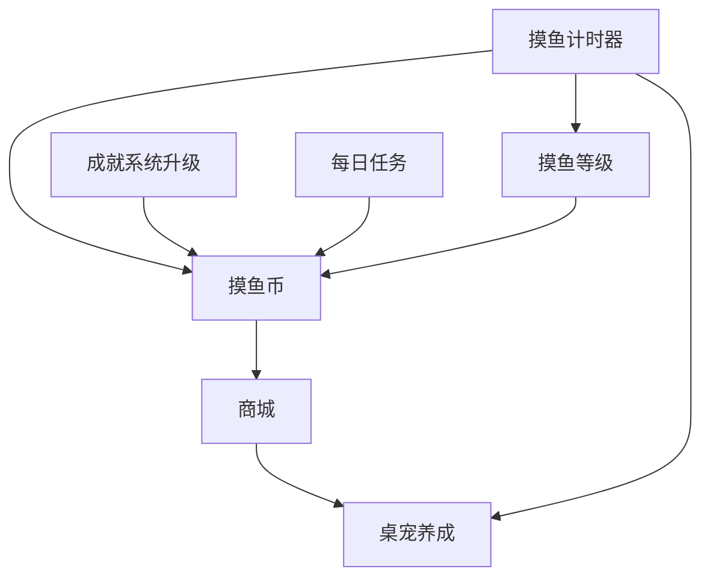

# 养成系统 · 需求文档（PRD）

> 作为新功能集成进现有产品「宜忌月历 · 摸鱼账本」。
> 本系统把已有的"摸鱼计时/记账"数据转化为**可养成、可炫耀、可花钱**的正反馈闭环：摸鱼时长 → 等级 → 摸鱼币 → 商城 → 桌宠养成。
> **核心红线：全程自嘲解压向，绝不真引导用户多摸鱼；桌宠零负担、不衰减、不惩罚。**
> 分期交付：**V1（MVP）** 先跑通"等级 + 摸鱼币 + 桌宠两态 + 基础商城"最小闭环，**V2** 补齐成就升级与每日任务，**V3** 丰富桌宠多态与限定内容。详见 §10。
>
> ⚠️ **本文所有数值均为建议值、可调。标注 🔴 的关键数值（尤其升级时长曲线）请重点确认后再进入开发。**

## 1. 背景与目标

现有扩展已具备摸鱼计时、记账、成就（`achievement-engine.js` / `achievements.js`）等能力，但数据是"死"的——记录完就结束，缺乏长期目标感与情绪回报。

本系统在现有数据之上叠加一层**游戏化养成**：让用户每一次摸鱼都能沉淀为等级、货币与桌宠的成长，把"记录工具"升级为"有养成陪伴的解压小天地"。

**核心价值**：
- **正反馈**：摸鱼有了看得见的成长（等级涨、币变多、桌宠更活泼）。
- **陪伴感**：桌宠常驻，成为摸鱼战绩的"活体仪表盘"。
- **长期目标**：稀有商城内容 + 隐藏成就，给用户攒币和收集的念想。
- **调性统一**：一切都是自嘲式黑色幽默解压，不制造愧疚、不催人摸鱼。

## 2. 名词与约定

| 名词 | 含义 |
|---|---|
| 摸鱼时长 | 由摸鱼计时器累计的有效摸鱼时间，是养成系统的核心输入 |
| 摸鱼等级 | 依据累计摸鱼时长划分的段位，越高级头衔梗越离谱 |
| 摸鱼币 | 系统内虚拟货币，用于商城消费，无充值、不可交易 |
| 桌宠 | 常驻页面的陪伴宠物，联动摸鱼计时器切换状态 |
| 商城 | 用摸鱼币兑换时装/表情/宠物/皮肤的地方 |
| 每日任务 | 每日刷新的轻量小目标，完成得币（V2） |
| 成就升级 | 在现有成就基础上增加隐藏成就、稀有度分级（V2） |

## 3. 核心调性与设计红线

**这一节是所有功能的价值观地基，任何设计与文案不得违背。**

| 红线 | 含义 | 反例（禁止） |
|---|---|---|
| 🚫 不真引导摸鱼 | 所有奖励是对"已发生行为"的调侃式回报，不设计成"为奖励去多摸鱼"的诱导 | 每日任务写"再摸够 2 小时领双倍币" |
| 🚫 桌宠不衰减 | 桌宠不掉数值、不生病、不死、不闹脾气；不理它也活得好好的 | 长时间不互动桌宠变瘦/生病/流泪 |
| 🚫 不制造愧疚 | 不用负面情绪绑架用户 | "你今天又没完成任务，桌宠很失望" |
| ✅ 只有正反馈 | 抚摸桌宠只掉币/道具，无惩罚项 | —— |
| ✅ 反向监督只当调味 | 桌宠偶尔嘴贫式"反向劝摸"（如"哥们儿…要不摸一会儿？"），纯黑色幽默，不强制不惩罚 | 弹窗强制"必须摸鱼才能关闭" |
| ✅ 自嘲式解压 | 所有文案走"摸鱼可耻但爽"的自黑路线 | 正经励志鸡汤 |

## 4. 系统总览

五大模块与核心闭环：

**核心闭环（一句话）**：摸鱼时长涨 → 等级升 & 得币；做成就/每日任务 → 额外得币；币拿去商城买时装/宠物；桌宠联动计时器陪你摸鱼 → 更想摸 → 回到起点。

| 模块 | 一句话职责 | 首次落地版本 |
|---|---|---|
| 摸鱼等级 | 把累计时长换算成有梗的段位与头衔 | V1 |
| 摸鱼币 | 全系统通用货币，连接产出与消费 | V1 |
| 桌宠 | 常驻陪伴，联动计时器切换状态 | V1（两态） |
| 商城 | 币的消费出口，收集与炫耀 | V1（基础） |
| 成就升级 | 隐藏成就 + 稀有度分级 | V2 |
| 每日任务 | 每日轻量小目标补充币产出 | V2 |

## 5. 摸鱼等级系统

把累计摸鱼时长换算成有梗的段位。等级只涨不掉（红线：不惩罚），越高级头衔越离谱、越自嘲。

### 5.1 段位设计（建议 8 段）

| 段位 | 头衔（梗） | 一句话调性 | 达成累计摸鱼时长 🔴 | 距上一级增量 | 特权 |
|---|---|---|---|---|---|
| Lv.0 | 公司最佳员工 | 你竟然不会摸鱼？ | 0（默认起点） | —— | —— |
| Lv.1 | 初级摸鱼学徒 | 刚学会假装在忙 | 10分钟 | +10min | —— |
| Lv.2 | 带薪如厕研究员 | 厕所是第一生产力 | 1 小时 | +50min | —— |
| Lv.3 | 划水中级工程师 | 摸鱼开始有技术含量 | 3 小时 | +2h | —— |
| Lv.4 | 资深咸鱼 | 躺平已成肌肉记忆 | 8 小时 | +5h | —— |
| Lv.5 | 摸鱼特级技师 | 老板走过都看不出来 | 20 小时 | +15h | —— |
| Lv.6 | 划水艺术家 | 摸鱼是一种美学 | 60 小时 | +40h | —— |
| Lv.7 | 摸鱼界扫地僧 | 深藏功与名 | 160 小时 | +100h | —— |
| Lv.8 | 摸鱼之神（封顶） | 传说级，已羽化登仙 | 365 小时 | +205h | —— |

### 5.3 升级奖励与特权

| 奖励类型 | 说明 |
|---|---|
| 升级弹窗 | 自嘲式恭喜文案 + 新头衔展示，一次性 |
| 摸鱼币 | 每升一级发一笔升级奖励币（建议 50 × 当前等级，可调） |
| 头衔展示 | 当前头衔展示在 popup / 桌宠气泡 |
| 桌宠新动作解锁 | 高段位解锁桌宠额外趣味动作（V3） |

> 特权只做"炫耀 + 币"，不做任何加速/数值碾压，避免破坏经济平衡。

## 6. 桌宠系统

常驻页面的陪伴宠物。定位：**零负担陪伴型打底 + 一撮反向监督黑色幽默调味**。它是摸鱼战绩的"活体仪表盘"，而不是需要伺候的电子宠物。

### 6.1 核心机制（红线复述）

| 机制 | 说明 |
|---|---|
| 零负担 | 不衰减、不掉数值、不生病、不死；不理它也活蹦乱跳 |
| 只有正反馈 | 抚摸随机掉落摸鱼币/道具，绝无惩罚（对标 Tabby Cat） |
| 反向监督调味 | 偶尔冒泡嘴贫式"反向劝摸"，纯黑色幽默，不强制、不惩罚 |
| 联动计时器 | 状态跟随摸鱼计时器切换（见 6.2） |

### 6.2 状态设计（V1 只做两态）

> V1 只区分「摸鱼态 / 非摸鱼态」，MVP 先跑通联动，V3 再丰富多态。

| 状态 | 触发条件 | 表现 |
|---|---|---|
| 摸鱼态 | 摸鱼计时器运行中 | 桌宠活泼/翻肚皮/摸鱼动画，偶尔气泡"就是这样，别停" |
| 非摸鱼态 | 计时器停止 | 桌宠慵懒待机，偶尔反向劝摸气泡"哥们儿…要不摸一会儿？" |

> 复用现有 `assets/mascot-cat.svg` / `mascot-fish.svg` 与 `css/mascots.css` 资源。

### 6.3 抚摸掉落

用户点击/抚摸桌宠，随机掉落正反馈（有每日次数上限，防刷币，见 §8 经济）。

| 掉落物 | 建议概率 | 说明 |
|---|---|---|
| 少量摸鱼币 | 70% | 主要正反馈 |
| 彩蛋文案 | 25% | 一句自嘲吐槽，无实物 |
| 稀有道具/碎片 | 5% | 兑换限定内容用（V3） |

> 建议每日抚摸掉币上限（如 10 次/天，可调），超出只出彩蛋文案不出币。

### 6.4 反向监督气泡

- 非摸鱼态偶发触发（如静默 N 分钟后随机冒一句）。
- 纯文案调味，点击气泡无强制行为，可一键忽略。
- 文案库走黑色幽默，示例："工位这么安静，不像你啊" / "老板不在，良辰吉时" / "摸一下会怀孕吗？不会，摸吧"。

> 🔴 **待确认点**：反向监督气泡的触发频率上限（避免打扰），建议默认较低频 + popup 可关闭开关。

## 7. 成就系统升级（V2）

现有成就（`js/achievements.js`）已有 `title/category/threshold/flavorText/icon` 结构，但**无稀有度分级、无隐藏成就、解锁不发币**。本节在不破坏现有数据的前提下叠加增强。

### 7.1 新增字段（向后兼容）

在现有成就对象上追加两个可选字段，老成就不填默认按普通处理：

| 新字段 | 含义 | 取值 |
|---|---|---|
| `rarity` | 稀有度 | `common` / `rare` / `epic` / `legendary` |
| `hidden` | 是否隐藏成就 | `true` / `false`（默认 false） |
| `coinReward` | 解锁奖励币 | 数字，按稀有度给（见 7.2） |

### 7.2 稀有度分级（建议 4 档）

| 稀有度 | 占比目标 | 解锁奖励币 🔴 | 视觉 |
|---|---|---|---|
| 普通 common | ~50% | 20 | 灰/白徽章 |
| 稀有 rare | ~30% | 50 | 蓝色徽章 |
| 史诗 epic | ~15% | 120 | 紫色徽章 |
| 传说 legendary | ~5% | 300 | 金色 + 特效 |

> 现有成就按门槛高低回填稀有度（如 24h 级归 epic，首次摸鱼归 common）。

### 7.3 隐藏成就

- 达成前**不显示标题与条件**，成就墙上以"？？？"占位，只透一句模糊线索 flavorText。
- 走怪梗/彩蛋路线，鼓励用户探索（如"凌晨 3 点还在摸鱼""连续摸鱼 7 天不间断"）。
- 解锁后正常显示并发币，给"意外之喜"的爽感。

> 🔴 **待确认点**：① 隐藏成就是否给模糊线索（建议给，纯问号太挫败）；② 隐藏成就总数量（建议 5–8 个起步）；③ 是否需要成就墙的稀有度筛选/收集进度条。

## 8. 摸鱼币经济

全系统通用货币。经济取向：**中等**——基础内容轻松拿，稀有/限定款要攒。目标是兼顾即时爽感与长期目标感，避免两种死法：① 通货膨胀（币太多没处花）；② 中后期无币可赚。

### 8.1 币的来源（产出）

| 来源 | 建议数值 🔴 | 频率 | 说明 |
|---|---|---|---|
| 摸鱼时长 | 1 币 / 每 5 分钟 | 持续 | 主力产出，只按已发生时长结算（红线：不诱导） |
| 等级提升 | 50 × 当前等级 | 偶发 | 一次性大额，制造升级爽点 |
| 成就解锁 | 20 / 50 / 120 / 300（按稀有度） | 偶发 | 见 §7.2 |
| 每日任务 | 单个 10–30 币 | 每日 | V2，见 §9 |
| 抚摸桌宠 | 单次 1–3 币，每日上限 10 次 | 每日 | 见 §6.3 |

> 估算：日均摸鱼 30 分钟 ≈ 6 币/天（时长）+ 抚摸约 15 币/天 + 每日任务约 40 币/天（V2），合计约 60 币/天。

### 8.2 币的出口（消费）

只进商城（§10），无其它消耗。定价采用**分层梯度**呼应"中等"取向：

| 内容层 | 定价区间 🔴 | 获取体感 |
|---|---|---|
| 基础层（常规时装/表情/普通宠物） | 30–150 币 | 几天日常摸鱼即可拿下 |
| 进阶层（精致时装/主题皮肤） | 300–800 币 | 攒一两周，有目标感 |
| 稀有/限定层（限定宠物/隐藏皮肤） | 1500+ 币 或 需高稀有度成就解锁 | 长期目标，炫耀向 |

### 8.3 防通胀与防刷

| 措施 | 说明 |
|---|---|
| 抚摸每日上限 | 每日掉币次数封顶（建议 10 次），防无限点击刷币 |
| 无充值无交易 | 币只能玩出来，杜绝外部注入 |
| 出口持续扩充 | 商城定期上新，保证中后期"币有处花" |
| 时长结算软上限 | 单日时长产币设软上限（建议 200 币/日 🔴），防挂机刷币 |

> 🔴 **待确认点**：① 时长产币比率（5min/币）；② 等级/成就奖励量级；③ 单日产币软上限；④ 是否需要"越攒越多、好东西越来越贵"的自然回收设计。

## 9. 每日任务（V2）

每日刷新的轻量小目标，补充币产出、给用户"今天来看看"的理由。

### 9.1 调性红线（最需要小心的地方）

> ⚠️ 每日任务最容易踩"诱导摸鱼"的红线。**任务必须是对自然行为的顺带奖励，绝不能写成"为了领币去多摸鱼"。**

| 做法 | 判定 |
|---|---|
| "查看今天的宜忌"、"抚摸桌宠 3 次"、"打开一次记账" | ✅ 行为无害，不诱导 |
| "累计摸鱼达 X 分钟就领币" | ⚠️ 谨慎：措辞要像"顺带发生"而非"去完成"，或直接避免 |
| "再摸够 2 小时领双倍" | 🚫 明确禁止 |

### 9.2 任务形态（建议每日 3 个）

| 任务类型 | 示例 | 奖励 🔴 |
|---|---|---|
| 陪伴类 | 抚摸桌宠 3 次 | 10 币 |
| 使用类 | 查看今日宜忌 / 打开记账一次 | 10 币 |
| 收集类 | 解锁任意 1 个成就 / 逛一次商城 | 20 币 |

### 9.3 刷新规则

- 每日 0 点刷新（本地时区），从任务池随机抽 3 个。
- 未完成不惩罚、不累积、不掉币（红线：不制造愧疚）。
- 全部完成给一个小额"全清奖励"（建议 +20 币，可调）。

> 🔴 **待确认点**：① 每日任务数量（建议 3）；② 是否含"摸鱼时长类"任务（涉及诱导红线，建议不含或极弱化）；③ 全清奖励额度。

## 10. 商城

摸鱼币的唯一出口，也是收集与炫耀的核心场景。

### 10.1 商品分类

| 分类 | 内容 | 作用 | 首次落地 |
|---|---|---|---|
| 桌宠时装 | 帽子/围巾/墨镜等装扮 | 给桌宠换装 | V1 |
| 桌宠表情/气泡 | 额外吐槽文案包、表情动作 | 丰富互动 | V1 |
| 新桌宠 | 除猫/鱼外的其它宠物 | 收集 | V1（普通款） |
| 主题皮肤 | 面板/桌宠整体皮肤 | 换风格 | V2 |
| 限定款 | 节日/成就联动限定 | 长期目标、炫耀 | V3 |

### 10.2 定价梯度（呼应 §8.2）

| 层级 | 商品举例 | 建议定价 🔴 |
|---|---|---|
| 基础 | 常规时装、表情包、普通新宠物 | 30–150 币 |
| 进阶 | 精致时装、主题皮肤 | 300–800 币 |
| 稀有/限定 | 限定宠物、隐藏皮肤 | 1500+ 币，或需高稀有度成就解锁 |

### 10.3 交互与约束

- 已购内容进"我的衣柜/宠物栏"，可自由切换装扮。
- 已购不可退款、不掉落（一次买断永久拥有）。
- 限定款可设"上架时间窗"制造稀缺感（V3），但绝不诱导摸鱼来赶限定。

> 🔴 **待确认点**：① 首发商品数量（建议基础层 10–15 件起步，避免太空）；② 新宠物走纯币购还是碎片兑换；③ 限定款是否引入。

## 11. 分期实现路线

| 能力 | V1 (MVP) | V2 | V3 |
|---|---|---|---|
| 摸鱼等级（8 段 + 头衔 + 升级弹窗 + 升级币） | ✅ | — | — |
| 摸鱼币（时长产出 + 等级产出 + 钱包 + 持久化） | ✅ | — | — |
| 桌宠两态联动 + 抚摸掉币 + 反向监督气泡 | ✅ | — | — |
| 商城基础层（时装/表情/普通宠物 + 衣柜切换） | ✅ | — | — |
| 成就升级（稀有度 + 隐藏成就 + 解锁发币） | — | ✅ | — |
| 每日任务（3 个/日 + 全清奖励） | — | ✅ | — |
| 商城进阶层（主题皮肤） | — | ✅ | — |
| 桌宠多态丰富 + 高段位专属动作 | — | — | ✅ |
| 商城限定款 + 碎片兑换 | — | — | ✅ |

> V1 目标：跑通"摸鱼 → 涨等级/得币 → 商城消费 → 桌宠换装陪伴"最小闭环即可上线验证。

## 12. 待定问题清单（需你拍板）

| 编号 | 模块 | 待确认 | 建议 |
|---|---|---|---|
| Q1 🔴 | 等级 | 升级时长曲线（8 段数值） | 见 §5.2，前松后紧 |
| Q2 🔴 | 等级 | 段数是否 8、是否要封顶后延长机制 | 8 段 + 小数点荣誉等级 |
| Q3 🔴 | 经济 | 时长产币比率 / 单日软上限 | 5min/币 / 200 币/日 |
| Q4 🔴 | 经济 | 等级、成就奖励币量级 | 见 §8.1 |
| Q5 | 桌宠 | 反向监督气泡频率 + 可否关闭 | 低频 + popup 开关 |
| Q6 | 成就 | 隐藏成就数量 / 是否给模糊线索 | 5–8 个 + 给线索 |
| Q7 | 每日任务 | 是否含摸鱼时长类任务 | 不含或极弱化 |
| Q8 | 商城 | 首发商品数量 / 限定款是否 V1 引入 | 基础 10–15 件 / 限定延后 V3 |
| Q9 | 全局 | 数据持久化方案 | 参考喝水提醒 storage.sync + local 双写 |

> **下一步**：待你确认 🔴 关键数值（尤其 Q1 升级曲线）后，进入 V1 技术方案设计与开发。